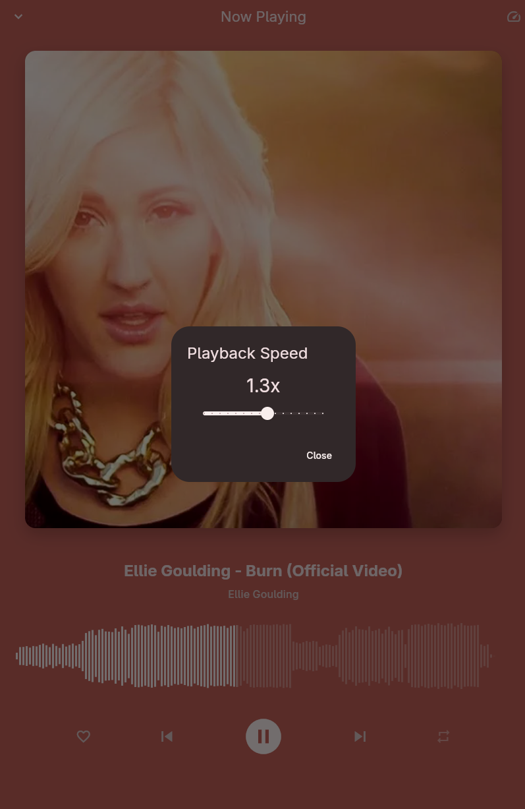

# Raku Music

A minimal, Linux-first music player built with Flutter.

## Screenshots

<p align="center">
  
  
</p>
<p align="center">
  
  
</p>
<p align="center">
  
</p>

## Installation

### Arch Linux (AUR)

You can install Raku Music directly from the AUR:

```bash
yay -S raku-music-bin
```

## Author

- **GitHub**: [sauraku](https://github.com/sauraku)
- **LinkedIn**: [sauraku](https://www.linkedin.com/in/sauraku)
